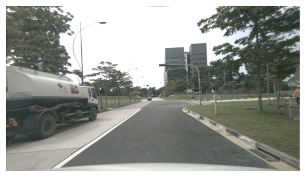

#### 代码运行

##### 环境配置

- `city945/tpvformer:cuda11.1-python3.8-pytorch1.10-devel`
  ```bash
  # FROM nvidia/cuda:11.1.1-cudnn8-devel-ubuntu20.04

  # 个人 shell 环境
  apt update ; \
  apt install -y git && cd; \
  git clone --depth 1 https://gitee.com/city945/oh-my-ubuntu.git ~/.oh-my-ubuntu && \
  bash .oh-my-ubuntu/install && rm -rf .oh-my-ubuntu && \
  rm -rf /var/lib/apt/lists/ && rm -rf .cache .vscode*

  zsh
  wget https://repo.anaconda.com/miniconda/Miniconda3-py38_23.5.2-0-Linux-x86_64.sh
  bash ./Miniconda3-py38_23.5.2-0-Linux-x86_64.sh # installed at /root/.local/share/miniconda3
  zsh

  pip install torch==1.10.0+cu111 torchvision==0.11.0+cu111 torchaudio==0.10.0 -f https://download.pytorch.org/whl/torch_stable.html # see https://pytorch.org/get-started/previous-versions
  rm -rf /var/lib/apt/lists/ && rm -rf .cache .vscode* Miniconda3*

  # TPVFormer
  pip install mmcv-full==1.4.0 mmdet==2.14.0 mmsegmentation==0.14.1 numba==0.48.0 numpy==1.23.1 Pillow==9.3.0 PyYAML==6.0 timm==0.4.12 'yapf<=0.40.1' nuscenes-devkit
  ```

##### 数据集准备

- 数据集文件结构
  ```bash
  data
  └── nuscenes
      ├── lidarseg -> /datasets/nuScenes/nuScenes-lidarseg/lidarseg
      ├── maps -> /datasets/nuScenes/Fulldatasetv1.0/maps
      ├── nuscenes_infos_train.pkl
      ├── nuscenes_infos_val.pkl
      ├── samples -> /datasets/nuScenes/Fulldatasetv1.0/samples
      ├── sweeps -> /datasets/nuScenes/Fulldatasetv1.0/sweeps
      └── v1.0-trainval
          ├── attribute.json -> /datasets/nuScenes/Fulldatasetv1.0/v1.0-trainval/attribute.json
          ├── calibrated_sensor.json -> /datasets/nuScenes/Fulldatasetv1.0/v1.0-trainval/calibrated_sensor.json
          ├── category.json -> /datasets/nuScenes/nuScenes-lidarseg/v1.0-trainval/category.json
          ├── ego_pose.json -> /datasets/nuScenes/Fulldatasetv1.0/v1.0-trainval/ego_pose.json
          ├── instance.json -> /datasets/nuScenes/Fulldatasetv1.0/v1.0-trainval/instance.json
          ├── lidarseg.json -> /datasets/nuScenes/nuScenes-lidarseg/v1.0-trainval/lidarseg.json
          ├── log.json -> /datasets/nuScenes/Fulldatasetv1.0/v1.0-trainval/log.json
          ├── map.json -> /datasets/nuScenes/Fulldatasetv1.0/v1.0-trainval/map.json
          ├── sample_annotation.json -> /datasets/nuScenes/Fulldatasetv1.0/v1.0-trainval/sample_annotation.json
          ├── sample_data.json -> /datasets/nuScenes/Fulldatasetv1.0/v1.0-trainval/sample_data.json
          ├── sample.json -> /datasets/nuScenes/Fulldatasetv1.0/v1.0-trainval/sample.json
          ├── scene.json -> /datasets/nuScenes/Fulldatasetv1.0/v1.0-trainval/scene.json
          ├── sensor.json -> /datasets/nuScenes/Fulldatasetv1.0/v1.0-trainval/sensor.json
          └── visibility.json -> /datasets/nuScenes/Fulldatasetv1.0/v1.0-trainval/visibility.json
  ```
- 数据集预处理：直接下载 [nuscenes_infos_train.pkl](https://cloud.tsinghua.edu.cn/f/ede3023e01874b26bead/?dl=1) 和 [nuscenes_infos_val.pkl](https://cloud.tsinghua.edu.cn/f/61d839064a334630ac55/?dl=1)

##### 快速入门

- 预训练模型评估与训练：[tpv04_occupancy_v2.pth](https://cloud.tsinghua.edu.cn/f/3fbd12101ead4397a0f7/?dl=1) [tpv10_lidarseg_v2.pth](https://cloud.tsinghua.edu.cn/f/f686e97feb18406592d9/?dl=1)

  ```bash
  # 测试
  wget https://github.com/zhiqi-li/storage/releases/download/v1.0/r101_dcn_fcos3d_pretrain.pth -P model_zoo/download/
  CUDA_VISIBLE_DEVICES=0,1 python eval.py --py-config config/tpv_lidarseg.py --ckpt-path model_zoo/download/tpv10_lidarseg_v2.pth
  CUDA_VISIBLE_DEVICES=0,1 python eval.py --py-config config/tpv04_occupancy.py --ckpt-path model_zoo/download/tpv04_occupancy_v2.pth
  # 训练
  CUDA_VISIBLE_DEVICES=0,1 python train.py --py-config config/tpv_lidarseg.py --work-dir out/tpv_lidarseg
  CUDA_VISIBLE_DEVICES=0,1 python train.py --py-config config/tpv_lidarseg_dim64.py --work-dir out/tpv_lidarseg_dim64
  CUDA_VISIBLE_DEVICES=0,1 python train.py --py-config config/tpv04_occupancy.py --work-dir out/tpv_occupancy
  ```
- 可视化

#### 代码阅读

##### 知识点

- 关于标签：nuscenes.yaml 中 labels 为 nuscenes 数据集原始语义分割类别，在 ImagePoint_NuScenes 中用 learning_map 映射为 0~16 共 17 类，这 17 类的标签含义在 labels_16 中给出。在点云语义分割任务中体素标签用 0(表示 noise 类别) 来初始化，在三维占据预测任务中体素标签用 17(非语义类别，表示未占用)来初始化
- 位置嵌入：即查找表，输入索引输出嵌入向量。有两种实现方式 `nn.Parameter` 和 `nn.Embedding`，前者直接定义参数矩阵(尺寸为 (N=嵌入总数, D=嵌入维度))，后者类内部定义参数矩阵并维护一个查找表，区别在于前者需要手动输入单个索引后者可以输入索引张量、前者可以手动操作参数矩阵如广播等

##### 代码笔记

- 中间数据可视化
  - PadMultiViewImage：底部黑边为填充 0，宽度 1600 能整除 32 故两侧无填充
  - GridMask: 相当于根据条幅宽度 d 用白刷子横竖（先按"三"字画再按"川"字画）将图像刷白，再根据掩盖宽度 l 用黑刷子（黑刷子"笔画细"(l小于d)且在白刷子笔画中间(有偏移量)）横竖将图像刷黑，最后黑白取反可得到格子状的掩膜
  - |  |  |  |
    | :-------------------------------------------------: | :-------------------------------------------------: | :-------------------------------------------------: |
    |                        原图                        |         PhotoMetricDistortionMultiViewImage         |               NormalizeMultiviewImage               |
    |  |  |  |
    |                  PadMultiViewImage                  |              点云点的体素坐标 grid_ind              |                      GridMask                      |

* 各种图像增强效果 ( #CN/00002# )
  * 调整亮度，图像整体变亮/暗；调整对比度，图像整体变亮/暗但色彩自然些（不会像调整亮度那样整体发白），越亮/暗的地方调整后越亮/暗
  * 调整饱和度，图像颜色越浓/淡；调整色度，图像色调沿色轮（红橙黄绿青蓝紫）顺/逆时针旋转，如图加 180 度顺时针旋转，绿色变成紫色
  * |  |  |  |
    | :-------------------------------------------------: | :-------------------------------------------------: | :-------------------------------------------------: |
    |                        原图                        |                      亮度+100                      |                     对比度*1.5                     |
    |  |  |                                                    |
    |                      饱和度*3                      |                     色度+180度                     |                                                    |
